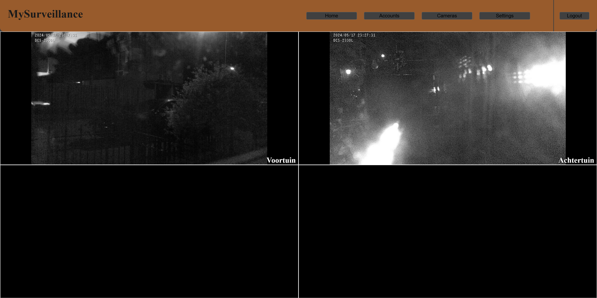

# MySurveillance

MySurveillance is surveillance software designed for use with cameras. 
Currently it has been tested only with IPCameras. 
 
Supports MJPEG. 
The software is programmed in Java and has been tested on Windows 10 and Ubuntu. 
 
<b>A preview of the Homepage</b>

## Jar download

You can download any stable or newest version in [/releases](https://github.com/rick1810/MySurveillance/releases)

## Config

- `port`: The port where the web server should run on.
- `screens`: An array of strings representing cameras. A string can be empty for no camera or can contain the name (case sensitive) of the camera.

## Usage

1. Run the following command to start the program: java -jar MySurveillance.jar

2. If no `config.json` is found, the program will create one and exit. You can then configure the `config.json` file as needed. (See the Config section.)

3. After configuration, restart the program. It can be accessed via HTTP in a web browser on the port configured in the `config.json`.

4. Login using the default credentials, `Admin` `0000`

5. Use the `stop` command to safely stop the program without losing any settings.

## Commands

- `save`: Saves config/accounts/cameras/files.
- `stop`: Saves config/accounts/cameras/files, toggles a boolean to stop all services. After 15 seconds, the program will force close itself in case any while loops are still active.
- `gui`: Open a new Gui, and closes any old ones.
- `radmin` : Resets/Create `Admin` account with default credentials `0000`

## Dependencies

- [JSONManager](https://github.com/rick1810/JSONManager) `1.0.7`
